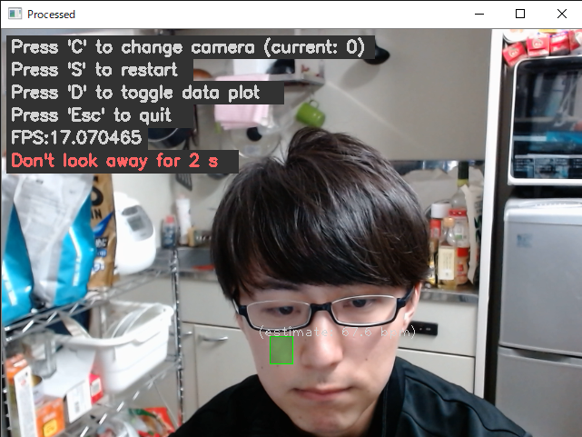
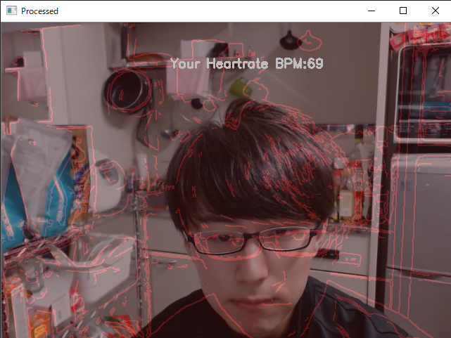

# PulseDetect_and_DigitalArt
脈拍検出と心拍数に合わせたデジタルアート

脈拍の検出を行った後に、その心拍数に応じたデジタルアートを出力します。

　
  

作成に当たり、脈拍検出の点は、以下のプログラムを参考にして作成しました。
 
https://github.com/thearn/webcam-pulse-detector

## 説明
### 事前準備
- カメラの入力をを必要とする作品です。
- Webカメラの準備をお願いします。

### 使い方
- 自身の顔を検出出来たら "S" を押して心拍数計測を開始してください。
- 計測中はあまり顔を動かさず画面かカメラを見ていることで良好な結果を望めます。
- 計測終了後、心拍数を基に視覚的アートを出力します。

### 作成環境
- CPU	：Intel Core i5-8400
- メモリ	：16GB
- GPU	：NVIDIA GeForce GTX 1650 SUPER
- 使用言語：Python3
- エディタ：VisualStudioCode
